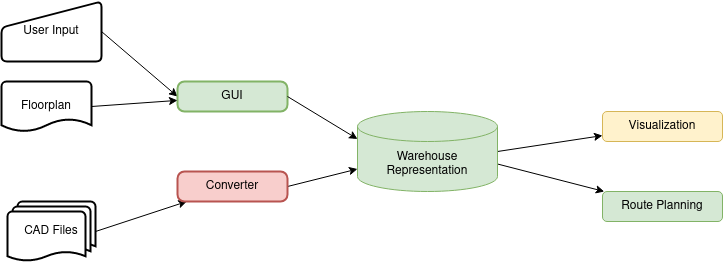
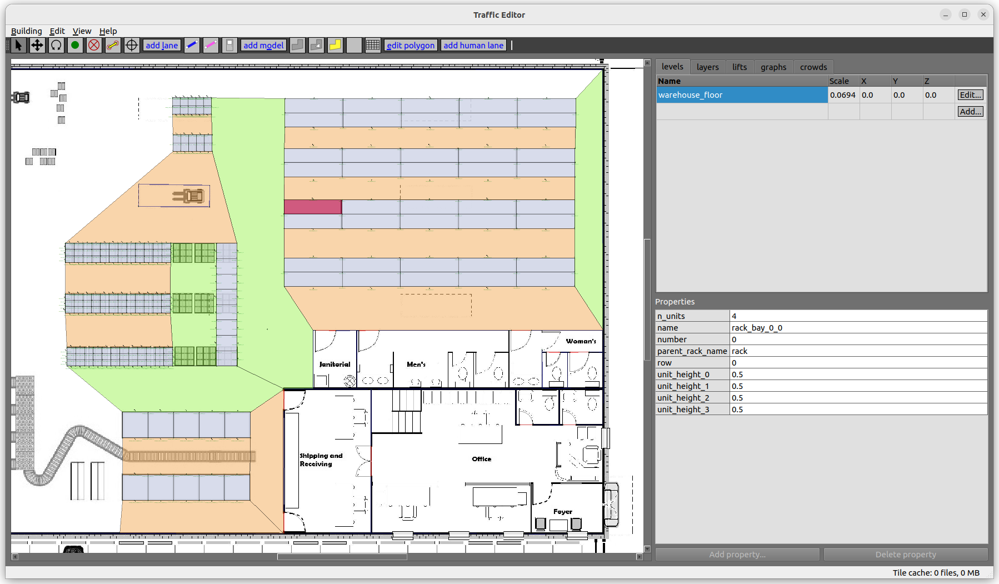

# rmf_traffic\_editor: warehouse edition

Hi there. 
This repo contains the work I did for my internship at Avular.
The goal was to create representation for a warehouse layout, that can be used by drones to carry out automated inventory inspection.

The goals were to provide a way to input and annotate a warehouse floorplan, including storage rack locations, aisles, walls etc. 
To achieve this I extended the `rmf_traffic_editor` software, which is a gui tool for creating floorplans and traffic patterns for the [RMF Project](https://github.com/open-rmf).

Additions were made to include warehouse-specific features such as storage racks and aisles, and to be able to plan routes within the warehouse.



## TL;DR
The project is structured as a collection of ROS 2 packages, and can be built using `colcon`.
The warehouse layout is saved in a yaml file, which can be created and edited using the `traffic_editor` GUI.
Python tools are provided to parse the yaml file and  create routes within the warehouse.

## Repo Structure

My work was done in the following parts of this repository:
- [rmf_traffic_editor](./rmf_traffic_editor): C++ -based GUI for creating floorplans. I made extensions to the GUI, as well as the code responsible for creating the yaml file.
- [planning_tools](./planning_tools): Python-based tools for parsing the yaml file and constructing a networkx graph of the warehouse layout. The networkx graph can be used to create routes within the warehouse.
- [rmf_traffic_editor_test_maps](./rmf_traffic_editor_test_maps): Example maps created using the `traffic_editor` GUI.  Taking a look at the yaml files reveals how the data is represented.


## Traffic Editor GUI



Instructions for using the `traffic_editor` are located [here](https://osrf.github.io/ros2multirobotbook/traffic-editor.html).
Two main addition were made to the GUI.

### **Storage Racks**
Storage racks can be added to the warehouse layout using the button with a rack symbol at the top of the gui (left from the edit polygon button) .
Racks are added just as any other polygon. 
The rack properties can be edited in the properties table (visible on the bottom right). 
Here you can set properties like the rack name, the amount of bays the rack will be subdivided into, and the default unit heights.
After setting the desired properties of a rack, the racks can be updated using the "update racks" button from the edit menu, or by pressing Control+u.

### **Aisles**
After defining storage racks, aisles can be added to the layout.
The button to add an aisle is located left to the rack button.
Aisles have a name, and can be classified as either a main aisle of a normal aisle.

Main aisles are the main corridors of the warehouse, where there will typically be more room for drones to navigate. 
Main aisles will preferred when generating routes within the warehouse.

### Special Notes

Some interface details were not explicitly mentioned in the [GUI documentation](https://osrf.github.io/ros2multirobotbook/traffic-editor.html):
- When creating a polygon, first create vertices by clicking on the map.
- To finish a polygon, right-click on the map (pressing enter or escape does not work).
- When creating a layout using a png image of the warehouse floorplan, the coordinates are so-called image coordinates. This means the y axis is flipped upside down.

### Where were the changes made?

I mainly made changes in the following files:

- [editor.cpp](./rmf_traffic_editor/gui/editor.cpp): Here I added the buttons detailed above.
- [level.cpp](./rmf_traffic_editor/gui/level.cpp): Here I added code for sub-dividing racks into bays, adding waypoints, and updating the yaml file.
- [polygon.cpp](./rmf_traffic_editor/gui/polygon.cpp): Entities like floors, racks and aisles are represented as polygons. Here I added code to represent racks, rack bays and aisles, complete with the necessary properties.


## YAML File Representation

The warehouse layout is saved in a `.building.yaml` file.
The first item in the heirarchy is the `building` object, which contains multiple levels.
During this project, I focused on a single level per warehouse building. 
However, it is possible to have multiple levels in a single building.

Here is an example of yaml representation of a level.

```yaml
    aisles:
      - parameters: {main_aisle: [4, false], name: [1, aisle_vert]}
        vertices: [3, 9, 8, 4]
      - parameters: {main_aisle: [4, false], name: [1, aisle]}
        vertices: [19, 5, 6, 20]
      - parameters: {main_aisle: [4, false], name: [1, aisle]}
        vertices: [16, 21, 20, 11, 14, 15]
    drawing:
      filename: test.png
    measurements:
      - [0, 2, {distance: [3, 10]}]
    rack_bays:
      - parameters: {n_units: [2, 4], name: [1, rack_1_bay_0_0], number: [2, 0], parent_rack_name: [1, rack_1], row: [2, 0], unit_height_0: [3, 0.5], unit_height_1: [3, 0.5], unit_height_2: [3, 0.5], unit_height_3: [3, 0.5]}
        vertices: [5, 23, 25, 24]
      - parameters: {n_units: [2, 4], name: [1, rack_1_bay_0_1], number: [2, 1], parent_rack_name: [1, rack_1], row: [2, 0], unit_height_0: [3, 0.5], unit_height_1: [3, 0.5], unit_height_2: [3, 0.5], unit_height_3: [3, 0.5]}
        vertices: [23, 3, 26, 25]
      - parameters: {n_units: [2, 4], name: [1, rack_1_bay_3_0], number: [2, 0], parent_rack_name: [1, rack_1], row: [2, 3], unit_height_0: [3, 0.5], unit_height_1: [3, 0.5], unit_height_2: [3, 0.5], unit_height_3: [3, 0.5]}
        vertices: [30, 31, 33, 6]
      - parameters: {n_units: [2, 4], name: [1, rack_1_bay_3_1], number: [2, 1], parent_rack_name: [1, rack_1], row: [2, 3], unit_height_0: [3, 0.5], unit_height_1: [3, 0.5], unit_height_2: [3, 0.5], unit_height_3: [3, 0.5]}
        vertices: [31, 32, 4, 33]
    storage_racks:
      - parameters: {name: [1, rack_1], num_bays: [2, 4], num_rows: [2, 2], unit_height_0: [3, 0.5], unit_height_1: [3, 0.5], unit_height_2: [3, 0.5], unit_height_3: [3, 0.5], units_per_bay: [2, 4], viewpoint_distance: [3, 3]}
        vertices: [5, 3, 4, 6]
      - parameters: {name: [1, rack_2], num_bays: [2, 4], num_rows: [2, 2], unit_height_0: [3, 0.5], unit_height_1: [3, 0.5], unit_height_2: [3, 0.5], unit_height_3: [3, 0.5], units_per_bay: [2, 4], viewpoint_distance: [3, 3]}
        vertices: [9, 10, 7, 8]
      - parameters: {name: [1, rack_3], num_bays: [2, 4], num_rows: [2, 2], unit_height_0: [3, 0.5], unit_height_1: [3, 0.5], unit_height_2: [3, 0.5], unit_height_3: [3, 0.5], units_per_bay: [2, 4], viewpoint_distance: [3, 6]}
        vertices: [11, 12, 13, 14]
    vertices:
      - [41.448999999999998, 157.39400000000001, 0, ""]
      - [111.754, 157.148, 0, ""]
      - [113.976, 156.45099999999999, 0, ""]
      - [383.54599999999999, 182.78800000000001, 0, ""]
      - [368.59699999999998, 182.78800000000001, 0, rack_1_vertex_0_1]
      - [353.64800000000002, 203.923, 0, rack_1_vertex_1_0]
      - [368.59699999999998, 203.923, 0, rack_1_vertex_1_1]
      - [383.54599999999999, 203.923, 0, rack_1_vertex_1_2]
      - [353.64800000000002, 225.059, 0, rack_1_vertex_2_0]
      - [368.59699999999998, 225.059, 0, rack_1_vertex_2_1]
      - [383.54599999999999, 225.059, 0, rack_1_vertex_2_2]
      - [353.64800000000002, 246.19399999999999, 0, rack_1_vertex_3_0]
      - [368.59699999999998, 246.19399999999999, 0, rack_1_vertex_3_1]
      - [386.54599999999999, 193.35599999999999, 0, rack_1_viewpoint_1_0, {is_inspection_point: [4, true]}]
      - [386.54599999999999, 214.49100000000001, 0, rack_1_viewpoint_1_1, {is_inspection_point: [4, true]}]
      - [210.31899999999999, 164.37299999999999, 0, rack_viewpoint_3_3, {is_inspection_point: [4, true]}]
```

We see a list of vertices at the bottom. Some are normal vertices, and some are viewpoints that can be used by drones for inspection tasks.
The racks and aisles are represented as polygons, with the vertices of the polygon listed in the `vertices` section.
The vertices are referenced by index in the list of vertices.

## Planning Tools

The planning tools are a collection of python scripts that can be used to parse the `.building.yaml` file and create a networkx graph of the warehouse layout.
The graph is created by adding edges between polygons that share a border.
Also, viewpoint are added as nodes to the graph, and edges are added between the viewpoints and the aisles they are in.

Creating a nice user interface with destination selection and route visualization has not been done yet.
To illustrate the usage of the planning tools, I created the example [parse_level.py](./planning_tools/parse_level.py) file.
In this file, an exmple warehouse layout is parsed, and a route is generated between two viewpoints.
Take a look at this file to get an idea of how the planning tools can be used.

## Installation

This repository is structured as a collection of ROS 2 packages and can be built using `colcon`.

Ubuntu 22.04 was used for development. 

Python dependencies are listed in the [`requirements.txt`](.requirements.txt) file


## Usage

After having built and sourced, the `traffic_editor` can be started by running

```bash
traffic_editor
```


