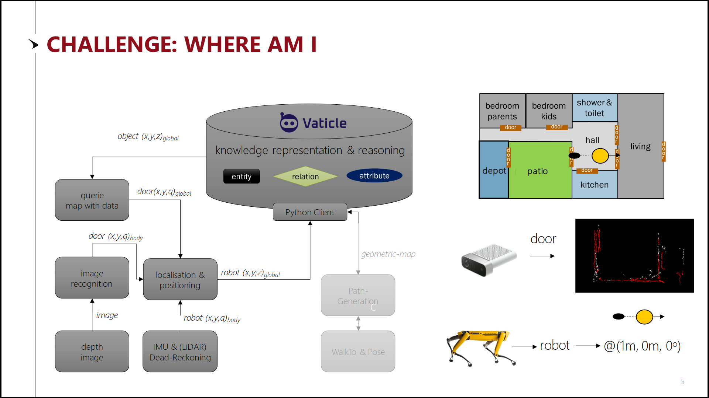
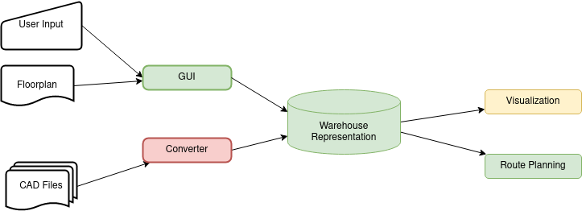
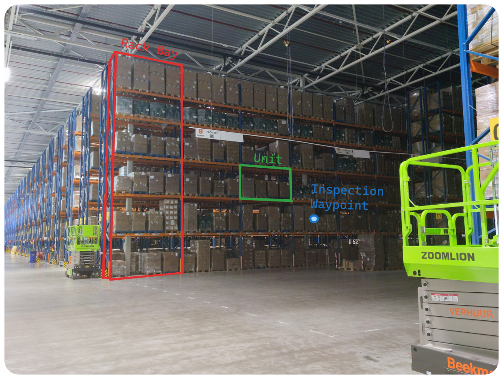
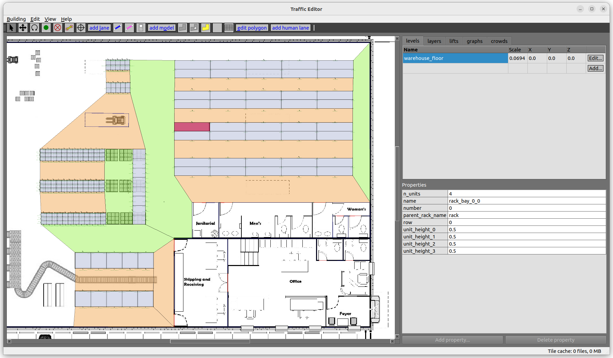
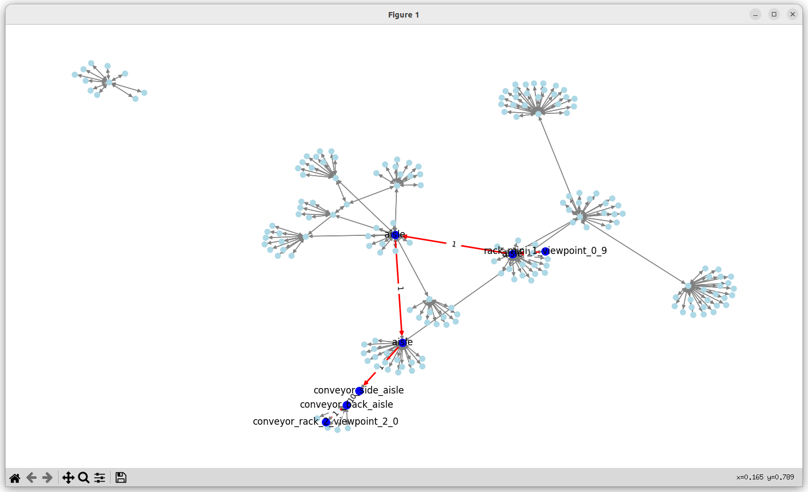
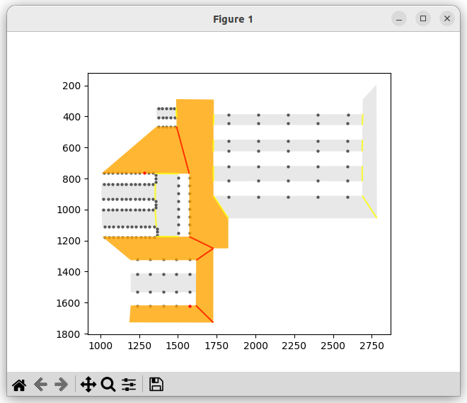
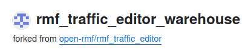

# **Stock Counting Drone**
_warehouse representation for automated inventory inspection_


---

## About me


* TU Delft Robotics
* Knowledge Representation course
* Joris Sijs lecture 

---

# Case



---

# Warehouse-Specific Features

---



## _Assumptions_
- rack consists of uniform **bays**
- **bay** consists of **units**
- **units** not necessarily uniform
- Aisles
  - main
  - non-main

---

# **TypeDB**


* Strongly Typed database
* Data integrity
* Inference
* Modelling complex relations

---
# **Open-RMF**


* Fleet management
* OSRF (Apache 2.0)
* `traffic_editor` repo
  - GUI for floorplans
  - .building.yaml file
  - (gazebo world export)

---

# Why Switch?


---

# User Input

---

### RMF Traffic Editor


---

# Workflow

1. upload floorplan png
2. create vertices
3. create rack bays
4. define aisles
5. parse `.building.yaml` file for path planning

---

## Floorplan Representation

```yaml


    aisles:
      - parameters: {main_aisle: [4, false], name: [1, aisle_vert]}
        vertices: [3, 9, 8, 4]
      - parameters: {main_aisle: [4, false], name: [1, aisle]}
        vertices: [19, 5, 6, 20]
      - parameters: {main_aisle: [4, false], name: [1, aisle]}
        vertices: [16, 21, 20, 11, 14, 15]
    drawing:
      filename: test.png
    measurements:
      - [0, 2, {distance: [3, 10]}]
    rack_bays:
      - parameters: {n_units: [2, 4], name: [1, rack_1_bay_0_0], number: [2, 0], parent_rack_name: [1, rack_1], row: [2, 0], unit_height_0: [3, 0.5], unit_height_1: [3, 0.5], unit_height_2: [3, 0.5], unit_height_3: [3, 0.5]}
        vertices: [5, 23, 25, 24]
      - parameters: {n_units: [2, 4], name: [1, rack_1_bay_0_1], number: [2, 1], parent_rack_name: [1, rack_1], row: [2, 0], unit_height_0: [3, 0.5], unit_height_1: [3, 0.5], unit_height_2: [3, 0.5], unit_height_3: [3, 0.5]}
        vertices: [23, 3, 26, 25]
      - parameters: {n_units: [2, 4], name: [1, rack_1_bay_3_0], number: [2, 0], parent_rack_name: [1, rack_1], row: [2, 3], unit_height_0: [3, 0.5], unit_height_1: [3, 0.5], unit_height_2: [3, 0.5], unit_height_3: [3, 0.5]}
        vertices: [30, 31, 33, 6]
      - parameters: {n_units: [2, 4], name: [1, rack_1_bay_3_1], number: [2, 1], parent_rack_name: [1, rack_1], row: [2, 3], unit_height_0: [3, 0.5], unit_height_1: [3, 0.5], unit_height_2: [3, 0.5], unit_height_3: [3, 0.5]}
        vertices: [31, 32, 4, 33]
    storage_racks:
      - parameters: {name: [1, rack_1], num_bays: [2, 4], num_rows: [2, 2], unit_height_0: [3, 0.5], unit_height_1: [3, 0.5], unit_height_2: [3, 0.5], unit_height_3: [3, 0.5], units_per_bay: [2, 4], viewpoint_distance: [3, 3]}
        vertices: [5, 3, 4, 6]
      - parameters: {name: [1, rack_2], num_bays: [2, 4], num_rows: [2, 2], unit_height_0: [3, 0.5], unit_height_1: [3, 0.5], unit_height_2: [3, 0.5], unit_height_3: [3, 0.5], units_per_bay: [2, 4], viewpoint_distance: [3, 3]}
        vertices: [9, 10, 7, 8]
      - parameters: {name: [1, rack_3], num_bays: [2, 4], num_rows: [2, 2], unit_height_0: [3, 0.5], unit_height_1: [3, 0.5], unit_height_2: [3, 0.5], unit_height_3: [3, 0.5], units_per_bay: [2, 4], viewpoint_distance: [3, 6]}
        vertices: [11, 12, 13, 14]
    vertices:
      - [41.448999999999998, 157.39400000000001, 0, ""]
      - [111.754, 157.148, 0, ""]
      - [113.976, 156.45099999999999, 0, ""]
      - [383.54599999999999, 182.78800000000001, 0, ""]
      - [368.59699999999998, 182.78800000000001, 0, rack_1_vertex_0_1]
      - [353.64800000000002, 203.923, 0, rack_1_vertex_1_0]
      - [368.59699999999998, 203.923, 0, rack_1_vertex_1_1]
      - [383.54599999999999, 203.923, 0, rack_1_vertex_1_2]
      - [353.64800000000002, 225.059, 0, rack_1_vertex_2_0]
      - [368.59699999999998, 225.059, 0, rack_1_vertex_2_1]
      - [383.54599999999999, 225.059, 0, rack_1_vertex_2_2]
      - [353.64800000000002, 246.19399999999999, 0, rack_1_vertex_3_0]
      - [368.59699999999998, 246.19399999999999, 0, rack_1_vertex_3_1]
      - [386.54599999999999, 193.35599999999999, 0, rack_1_viewpoint_1_0, {is_inspection_point: [4, true]}]
      - [386.54599999999999, 214.49100000000001, 0, rack_1_viewpoint_1_1, {is_inspection_point: [4, true]}]
      - [210.31899999999999, 164.37299999999999, 0, rack_viewpoint_3_3, {is_inspection_point: [4, true]}]
```

`warehouse.building.yaml`

---

# Path Planning


---

# Graph Structure

[](https://mermaid.live/edit#pako:eNplkE8LgkAQxb_KMCeFOtTRQ5DZLS8FnfYyuGMu6K6sIxLVd29TiAXnNLz3e8yfF1ZOM2ZYt26qGvICl6uyEOqYJHfDU--MFdilKWy3B8iToxlaThck_2nvkISJzaORN5ySkoyFGDrNUBP8P5XHThwv1vFiPSMy4BxvuU_nEG6wY9-R0eGw109RKA13rDALreaaxlYUKvsJKI3ibk9bYSZ-5A2OvSbhwtDDU4dZTe0QVNZGnC-XZ80_-3wBe4tiiw)

---

# Planning Example

---


---

### _Networkx representation_



---

### _Occupancy map_


---

# What remains to be done?

* Planning dashboard
* Linking client warehouse-management
* Other import methods

---

# **Thanks for your attention**

